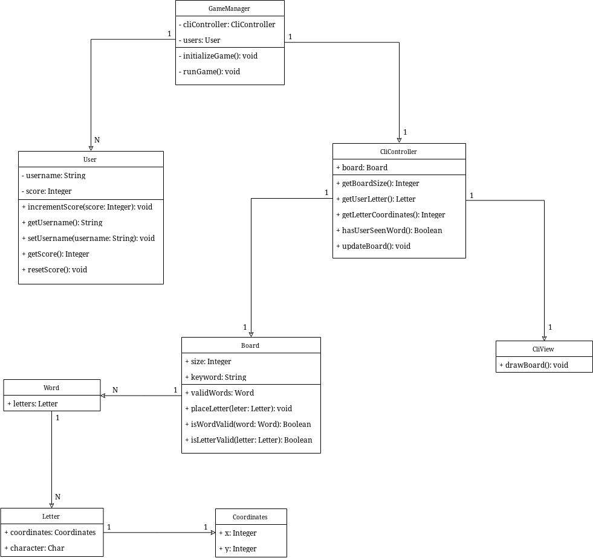

# OSO Game

We pretend to create a beefed-up version of the popular game three in a row.
This game follows the same mechanics, except for a couple of rules:
* The game doesn't finish until the board is completeley full
* The users score points based on how many "OSO" words they can spot and create
* The user with most points, wins the game

## Class diagram *(TODO: to be updated)*

